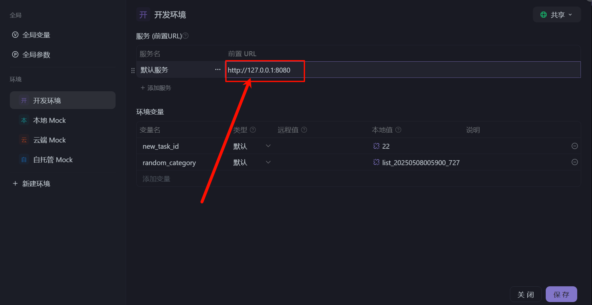
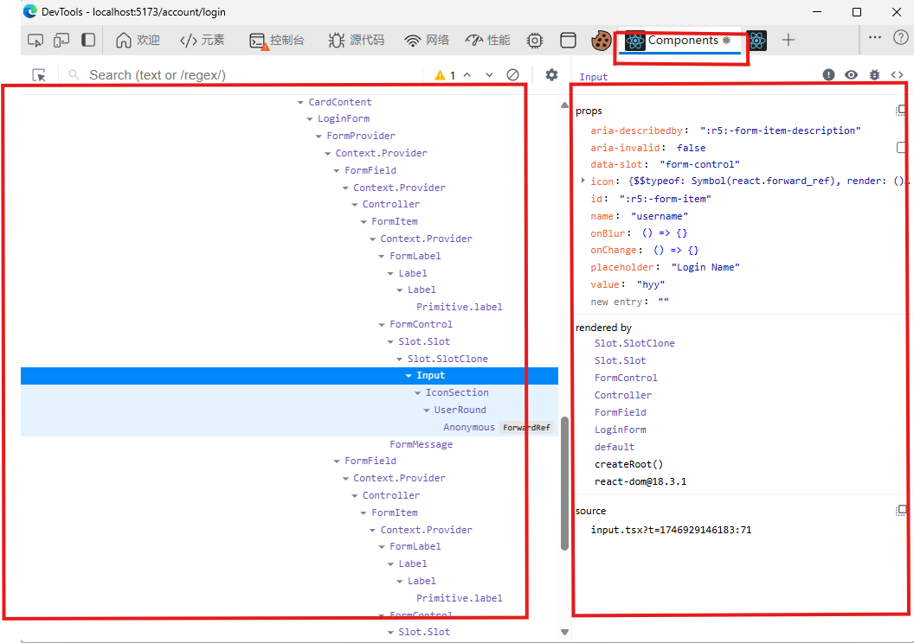

# 项目介绍

本项目将实现一个具备完整功能的 TodoList 系统，主要功能模块包括：

✅ **用户认证模块**

- 用户注册与登录
- 登出功能
- 用户信息更新
- 头像上传

✅ **任务管理模块**

- 任务的增删改查(CRUD)
- 任务分类管理
- 状态与截止时间管理

✅ **安全控制模块**

- JWT 鉴权机制
- 全局异常处理
- 接口权限控制（登录/未登录状态）

📦 **技术栈**

- 后端：Spring Boot + Maven + MySQL
- 可选前端：React, Vue
- 接口测试：Apifox

> [!NOTE]
> **作者已实现部分**
>
> - 基础项目框架搭建
> - 全局异常处理机制
> - DTO 数据传输对象设计
> - JWT 鉴权配置
> - 常用工具类封装
>
> **需要实现部分**
>
> - 数据持久层（Repository）可以使用 JPA 或者 MyBatis. 接口文件都在 `/src/repository` 中, MayBatis 的 `xml` 文件都在 `/resources/mapper`
> - 业务逻辑层（Service）
> - 接口控制层（Controller）

---

# 环境准备

## 1. Maven 换源配置

创建配置文件（路径：`C:\Users\<你的用户名>\.m2\settings.xml`）：

```xml
<settings>
    <mirrors>
        <mirror>
            <id>aliyunmaven</id>
            <name>阿里云公共仓库</name>
            <url>https://maven.aliyun.com/repository/public</url>
            <mirrorOf>central</mirrorOf>
        </mirror>
    </mirrors>
</settings>
```

执行依赖安装：

```bash
mvn clean install -T 1C
```

## 2. JDK 配置


要求：

- 必须使用 JDK 21
- 配置项目SDK为21版本

## 3. 数据库配置

1. 创建数据库：

```sql
CREATE
DATABASE TodoList;
USE
TodoList;
```

2. 修改配置文件（application.yml）：


```yaml
spring:
    datasource:
        url: jdbc:mysql://localhost:3306/TodoList
        username: root  # 修改为你的数据库账号
        password: root  # 修改为你的数据库密码
```

3. 测试数据库连接：
   

------

# 接口测试指南

## Apifox 使用说明

1. 下载测试套件：
   

2. 导入测试配置：
   

3. 修改前置 url. 修改为 `http://127.0.0.1:8080`

   

4. 执行自动化测试：
   

✅ 成功测试示例：


------

# 开发提示

1. 使用 IDEA 的 TODO 功能定位待实现代码：
   
2. 启用被注释的方法（Ctrl+/）：
   
3. 数据库连通性检查：
   
4. 配置文件修改示例(修改成你的mysql的用户名和密码) ：
   


通过 Swagger 测试注册接口：

```url
http://localhost:8080/swagger-ui/index.html
```


# 前端项目设计

## 项目前置准备

本项目基于 **[Vite](https://vitejs.dev/)** + **React** + **TypeScript**，使用了 **[Tailwind CSS](https://tailwindcss.com/)** 作为原子化 CSS 工具，并集成了 **shadcn/ui** 组件库。使用之前请完成以下前置工作：

+ **安装Vite脚手架**

  ```powershell
  npm create vite@latest
  pnpm create vite (推荐)
  ```

  (pnpm下载得基于npm,没有安装pnpm去 [pnpm中文文档](https://www.pnpm.cn/installation) 自己找，换源什么的不多赘述)

+ **配置Tailwind CSS**
  📄 Tailwind CSS 官网文档：
   👉 https://tailwindcss.com/docs/installation

+ **配置shadcn/ui组件**
  📄 shadcn/ui 官网配置文档：
   👉 https://ui.shadcn.dev/docs/installation
  要注意的是运行：
  
  ```powershell
  pnpm dlx shadcn@latest init
  ```
  
  的时候会在你原始的main.css文件下配置主题，这边建议


  **(建议先去配置shadcn/ui,再去看Tailwind CSS。shadcn配置文档会教你如何配置Tailwind CSS。使用 shadcn 组件前，Tailwind 必须已正确配置)**

## 项目结构

```markdown
web/
├── node_modules/            // 项目依赖文件夹（自动生成）
├── public/                  // 公共资源目录
├── src/                     // 源代码主目录
│   ├── api/                 // 接口请求封装（如 axios 实例、API 方法等）
│   ├── assets/              // 静态资源目录(可以修改你的Todo-List的Logo)
│   ├── components/          // 通用组件库（按钮、模态框等）
│   ├── lib/                 // 第三方库封装或工具库
│   ├── models/              // 类型模型定义（如接口响应结构等）
│   ├── pages/               // 页面级组件（路由组件）
│   ├── router/              // 路由配置文件（如 react-router-dom 配置）
│   ├── storages/            // 本地存储封装（localStorage 等）
│   ├── styles/              // 全局样式文件（如 Tailwind、全局 CSS）   介绍
│   ├── types/               // 全局类型定义
│   ├── utils/               // 工具函数（如日期处理、加密等）
│   ├── App.tsx              // 应用主组件
│   ├── main.tsx             // 应用入口文件
│   └── vite-env.d.ts        // Vite 的环境类型定义
├── .gitignore               // Git 忽略文件配置
├── .prettierrc              // Prettier 代码格式化配置  介绍
├── components.json          // 组件库配置（可选）
├── eslint.config.js         // ESLint 配置文件
├── index.html               // HTML 入口文件
├── package.json             // 项目信息和依赖列表
├── package-lock.json        // 锁定依赖版本
├── README.md                // 项目说明文档
├── tsconfig.json            // TypeScript 基础配置
├── tsconfig.app.json        // 应用专用的 TS 配置
├── tsconfig.node.json       // Node 环境的 TS 配置
└── vite.config.ts           // Vite 配置文件

```
## 🧩 前端通用工具与类型定义说明

本文件主要说明了项目中 `types/`、`utils/` 目录下的工具函数、类型定义与全局配置用途及使用方式

### 📁 `types/index.tsx`

#### `WebResponse<T>`

统一定义接口响应结构，适用于所有后端 API 通信的泛型封装。

```ts
export interface WebResponse<T> {
  code: number;        // 状态码，如 200 表示成功，1004 表示未登录等
  data?: T;            // 返回的泛型数据
  msg?: string;        // 错误或成功提示信息
  ts: number;          // 时间戳
  total?: number;      // 数据总量（用于分页）
}
```


### 📁 `utils/index.ts`

🧩 `cn(...)` 工具函数

```ts
import { clsx, type ClassValue } from "clsx";
import { twMerge } from "tailwind-merge";

export function cn(...inputs: ClassValue[]) {
  return twMerge(clsx(inputs));
}
```

##### ✅ 功能说明

- 用于合并多个类名字符串，自动解决 Tailwind CSS 的类冲突。
- 类似 `classnames`，但增强了 Tailwind 专用的合并逻辑。

### 📁 `utils/alova.ts`

#### 🌐 网络请求封装

使用 alova 配合 fetch 构建统一请求器。

```ts
import { createAlova } from "alova";
import adapterFetch from "alova/fetch";

export const alova = createAlova({
  baseURL: "/api",
  requestAdapter: adapterFetch(),
  timeout: 5000,
  shareRequest: true,
  statesHook: ReactHook,
  responded: {
    onSuccess: async (response, _method) => {
      const res = await response.json();
      // 通用拦截逻辑
    }
  }
});
```

##### 🔐 通用拦截逻辑

- `1004`: 未登录 → 跳转登录页并清除用户状态。
- `502`: 后端挂了 → 弹出错误提示。

### 📁 `utils/global-router.ts`

#### 🌍 全局路由跳转支持

```ts
const globalRouter = { navigate: undefined } as {
  navigate?: NavigateFunction;
};

export default globalRouter;
```

##### 🧭 使用方式 (具体的使用在项目代码里写了注释)

在 `layout.tsx` 中初始化：

```tsx
globalRouter.navigate = useNavigate();
```


## 📦 状态管理模块：`storages/`

### 1. `auth.ts` - 用户认证状态管理

**路径**：`storages/auth.ts`
 **依赖**：[Zustand](https://github.com/pmndrs/zustand)、`User` 模型

```ts
// storages/auth.ts

import { User } from "@/models/user";
import { create } from "zustand";
import { createJSONStorage, persist } from "zustand/middleware";

/**
 * ✅ 说明：
 * 全局用户认证状态管理
 * - 使用 zustand 管理用户登录信息
 * - 支持持久化存储（localStorage），实现刷新页面后仍保持登录
 *
 * ✅ 为什么使用 zustand？
 * - 简洁轻量
 * - 使用简单但功能强大(persist)
 */

// 用户状态接口
interface AuthState {
    user?: User;                      // 当前登录用户（包括用户名、头像等）
    setUser: (user?: User) => void;  // 设置用户信息（登录后使用）
    clear: () => void;               // 清空用户信息（登出时使用）
}

// 创建状态管理：useAuthStore 包含 user, setUser, clear
export const useAuthStore = create<AuthState>()(
    persist(
        (set, _get) => ({
            setUser: (user?: User) => set({ user }),     // 设置用户
            clear: () => set({ user: undefined }),       // 清空用户
        }),
        {
            name: "auth",                                 // localStorage 的 key 名称
            storage: createJSONStorage(() => localStorage), // 使用 localStorage 存储
        }
    )
);

```


#### ✅ 功能说明

`auth.ts` 使用 `zustand` 管理全局的用户认证状态。它负责：

- 存储当前登录用户的信息（如用户名、头像等）
- 在用户登录、退出时更新状态
- 利用 `zustand/middleware/persist` 插件将状态持久化到 `localStorage`，支持页面刷新后的状态保持

#### 📘 使用场景

- 判断用户是否已登录
- 获取当前用户信息用于展示（如头像、昵称）
- 实现退出登录时的状态清除
- 页面刷新后自动保持登录状态

通过 `useAuthStore()` 可访问：

- `user`: 当前用户对象（可为空）
- `setUser(user?: User)`: 设置用户信息
- `clear()`: 清除用户信息（登出时调用）

### 2. `shared.ts` - 通用刷新状态管理

**路径**：`storages/shared.ts`
 **依赖**：仅依赖 `zustand`

```ts
// storages/shared.ts

import { create } from "zustand";

/**
 * ✅ 说明：
 * 用于组件之间共享状态的全局 store
 * 当前仅用于提供页面/组件刷新信号
 *
 * 使用场景示例：
 * - 用户更新信息后，需要其他组件重新拉取数据
 * - 点击某个操作，想通知多个组件重新加载
 */

// 共享状态接口
interface SharedState {
    refresh: number;        // 每次更新都会自增，触发依赖该值的组件重新渲染
    setRefresh: () => void; // 执行一次刷新：refresh + 1
}

// 创建共享状态管理：useSharedStore 包含 refresh 和 setRefresh
export const useSharedStore = create<SharedState>()((set, get) => ({
    refresh: 0,
    setRefresh: () => set({ refresh: get().refresh + 1 }),
}));

```


#### ✅ 功能说明

`shared.ts` 提供一个简单的全局状态 `refresh`，用于跨组件传递“刷新信号”。

- 通过递增的 `refresh` 数值，实现依赖组件的响应式刷新
- 适合用在“某个地方数据变了，其他地方需要感知并刷新”这种场景中

#### 📘 使用场景 (在update-list-dialog中的例子)

```tsx
const sharedStore = useSharedStore()
const onSubmit = form.handleSubmit(async (values) => {
        setLoading(true)
        try {
            ...
            if (res.code === 200) {
                sharedStore.setRefresh()// 在操作成功后手动触发一次全局刷新信号，侧边栏会出现新的list名字
                onClose()
                navigate(`/list/${values.category}`)//然后跳转到更新的list页面
            } ...
        } catch (err) {
           ...
        } finally {
            ...
        }
    })
return (
    ...
    <Form{...form}>
    	...
        <form onSubmit={onSubmit}...>
        	<Button
            ...
            type={"submit"}>
        	...
        	</Button>
        </form>
    </Form>
```


通过 `useSharedStore()` 可访问：

- `refresh`: 数值，每次调用 `setRefresh()` 都会 +1
- `setRefresh()`: 用于手动触发刷新


## 📁 `models/user.ts` 模块说明文档

### ✅ 作用

定义项目中与「用户（User）」相关的数据结构，即 `User` 类型接口。它用于标识、约束用户对象包含的字段类型，是整个项目在登录、注册、更新用户信息等操作中统一使用的用户模型。

### 📦 User 接口字段说明

```ts
export interface User {
    id?: number; // 用户 ID
    username?: string; // 用户名
    password?: string; // 密码（登录或注册时用）
    confirm_password?: string; // 确认密码（注册时使用）
    avatarUrl?: string; // 用户头像 URL
}
```

> 所有字段均为 ?（`表示可选`），以方便在表单处理、局部更新时使用。

### 🧠 使用场景

- 注册表单中，使用 `User` 模型进行类型推导；
- 登录响应中，服务端返回的用户数据统一使用该结构；
- 在全局状态 `auth.ts` 中存储的 `user` 类型也是该接口。

## 📁 `api/user/index.ts` 模块说明

### ✅ 作用

封装与「用户」相关的所有 API 请求方法，所有请求都通过 `alova` 请求实例发出，并统一使用 `WebResponse` 类型封装响应结果。

### 📡 API 一览表

| 方法名         | 请求路径         | 请求方式 | 用途         |
| -------------- | ---------------- | -------- | ------------ |
| `login`        | `/user/login`    | POST     | 登录         |
| `logout`       | `/user/logout`   | GET      | 注销登录     |
| `register`     | `/user/register` | POST     | 注册账号     |
| `updateUser`   | `/user`          | PATCH    | 修改用户信息 |
| `uploadAvatar` | `/user/upload`   | POST     | 上传用户头像 |


### 🧩 请求类型定义

```ts
// 登录请求体
export interface UserLoginRequest {
    username: string;
    password: string;
}

// 注册请求体
export interface UserRegisterRequest {
    username: string;
    password: string;
    confirm_password: string;
}

// 更新用户信息请求体
export interface UserUpdateRequest {
    id: number;
    username?: string;
    password?: string;
}
```


### 🔄 响应格式统一封装

所有 API 响应都使用如下通用格式封装：

```ts
interface WebResponse<T> {
    code: number;
    data?: T;
    msg?: string;
    ts: number;
    total?: number;
}
```

例如：

- 登录返回：`WebResponse<User>`
- 上传头像返回：`WebResponse<string>`（返回头像地址）

## routers文件使用说明

`routers`（即路由配置）的**根本目的是管理前端页面的访问路径与组件渲染关系**，让你的 React 应用能像一个网站一样，根据 URL 显示不同的页面内容。

### 📘 一、基础知识：React Router 的基本概念

- `createBrowserRouter`：基于 `window.history` 的路由方案（适用于 Web 项目）。
- `lazy:`：懒加载组件，只有当访问到对应路由时才会动态加载对应的页面代码（优化首屏体积）。
- `children:`：嵌套路由，用于嵌套页面布局、复用 UI。
- `index: true`：指定为默认子路由，即访问父路径时自动加载这个子页面。

### ✅ 三、具体路由项说明

### 1. `/account/settings`（独立页面）

```tsx
{
  path: "/account/settings",
  lazy: async () => ({
    Component: (await import("@/pages/account/settings")).default,
  }),
}
```

- **作用**：用户设置页面。
- **特点**：不在 layout（主布局）下，是一个单独页面，比如不显示侧边栏。

------

### 2. `/`（主路由，挂载 layout）

```tsx
{
  path: "/",
  lazy: async () => ({
    Component: (await import("@/pages/layout")).default,
  }),
  children: [...]
}
```

- **作用**：定义了一个 `layout.tsx` 布局，所有 children 路由会嵌套在这个布局中。
- **比如：** `/list`、`/account/login` 都显示在 layout 下。

------

### 3. `/` 首页路由（子项 index:true）

```tsx
{
  index: true,
  lazy: async () => ({
    Component: (await import("@/pages/home")).default,
  }),
}
```

- **index: true**：表示这是 `/` 路径的默认子页面。
- **渲染路径**：访问 `/` 时，加载 `home` 页面。

------

### 4. `/list` 和 `/list/:category`

```tsx
{
  path: "list",
  children: [
    {
      index: true, // -> "/list"
      lazy: async () => ({
        Component: (await import("@/pages/list")).default,
      }),
    },
    {
      path: ":category", // -> "/list/work"、"/list/fun"
      lazy: async () => ({
        Component: (await import("@/pages/list/index.tsx")).default,
      }),
    },
  ],
}
```

- `:category` 是一个动态参数（例如 `/list/work`）。
- 可以通过 `useParams()` 在页面组件中拿到 `category` 值。

------

### 5. `/account/login` 和 `/account/register`

```tsx
{
  path: "account",
  children: [
    {
      path: "login",
      lazy: async () => ({
        Component: (await import("@/pages/account/login")).default,
      }),
    },
    {
      path: "register",
      lazy: async () => ({
        Component: (await import("@/pages/account/register")).default,
      }),
    },
  ],
}
```

- 显示登录与注册界面。
- 挂在 layout 下（你可以决定是否在 `layout.tsx` 里根据 route 隐藏 header/sidebar）。

## 前端如何定位错误

### 以 `login-form ` 为例

###  一、常见问题排查顺序

```tsx
function LoginForm() {
	...
    function onSubmit(values: z.infer<typeof formSchema>) {
        console.log("正在提交登录信息：", values); // 打印用户输入
        setLoading(true);
        login({ ...values })
            .then((res) => {
                console.log("登录接口返回：", res); // 打印接口返回值
                if (res.code === 200) {
                    const avatar_url = `http://localhost:8080${res.data?.avatarUrl}`;
                    authStore.setUser({
                        ...res.data,
                        avatarUrl: avatar_url
                    });
                    toast.success("登录成功", {
                        id: "login-success",
                        description: `欢迎回来, ${res.data?.username}`
                    });
                    navigate("/"); // 跳转首页
                }
                if (res.code === 1002) {
                    toast.error("登录失败，用户名或密码错误", {
                        id: "login-error",
                        description: res.msg
                    });
                }
            })
            .catch((err) => {
                console.error("登录请求出错：", err); // 捕获异常
                toast.error("系统错误，请稍后再试");
            })
            .finally(() => {
                setLoading(false);
            });
    }
    return (
	...
)
export { LoginForm };
```

1. **表单没反应？**
   - 是否绑定了 `onSubmit`？
   - 看控制台有没有打印。
   - 🔍 加上 `console.log("提交内容：", values);`
2. **接口没返回？**
   - 打开浏览器 → F12 → Network → 找 `login` 请求
   - 查看：
     - 状态码是否是 200？
     - 响应数据结构对吗？
3. **页面不跳转？**
   - `navigate("/")` 是否执行？
   - 看控制台是否有跳转相关报错。
4. **toast 没弹出？**
   - 确认是否满足 `res.code === 200`。
   - 检查 `toast.success` 调用有没有执行。

## 定位样式(使用React Developer Tool插件)

下载地址：[React Developer Tools – React](https://react.dev/learn/react-developer-tools)


#### **查看组件树结构**(左侧)

- 能看到你的整个 React 应用是怎么组织的。
- 组件嵌套关系一目了然，能快速定位你写的组件（如 `LoginForm`）。

#### 2. **查看和修改 props / state / hooks**（右侧）

- 选中一个组件，比如 `LoginForm`，可以直接看到：
  - 它的 `props` 是什么？
  - 它的 `useState` 状态值现在是多少？
  - 它用了哪些 hooks？
