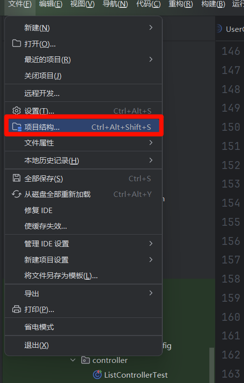
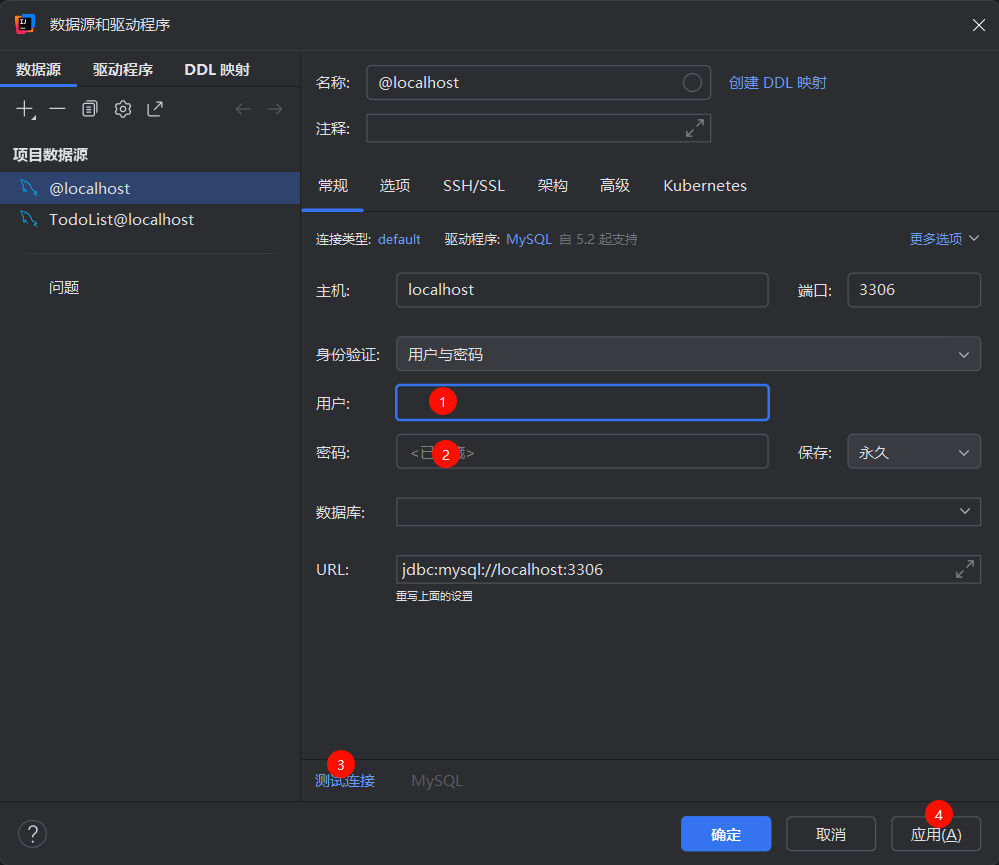
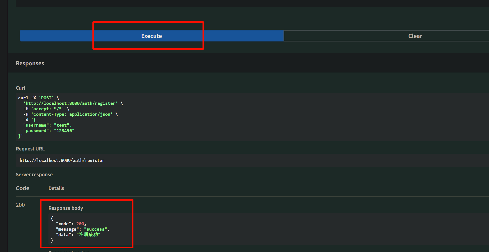

# 项目介绍

本项目将要完成一个 TodoList 系统, 包含以下几个部分

1. 登录和注册
2. 任务的增删改查
3. 各种边界异常的处理
4. 权限的控制(只有登录和没有登录两种状态, 没有其他权限)

我将会保留注册相关流程的代码用于示例, 其他的代码需要同学们自己完成,
本项目采用**测试类**来检验项目的**完成度**, 同学们在完成某个功能的代码之后可以自己先测试
一下自己的接口对不对, 然后再到测试类测试一下边界情况是否考虑到了, 本项目没有**标准答案**,
所有可以通过测试类的代码都是标准答案.

技术栈: mysql + spring boot + Maven + React(可选)

# 项目设计

## 项目结构

```
src/
├── main/
│   ├── java/
│   │   └── com/
│   │       └── todo_list/
│   │           ├── controller/          // 控制器层 (REST API)
│   │           ├── service/             // 服务层 (业务逻辑)
│   │           ├── repository/          // 数据访问层 (DAO)
│   │           ├── model/               // 实体类 (JPA)
│   │           ├── dto/                 // 数据传输对象
│   │           ├── config/              // 配置类
│   │           ├── exception/           // 异常处理相关
│   │           ├── security/            // 安全处理相关
│   │           ├── utils/               // 工具类
│   │           └── Application.java     // 主启动类
│   ├── resources/
│   │   ├── application.yml              // 应用配置文件 (YAML 格式为 application.yml)
│   │   └── db.migration/                // flyway 数据库迁移相关文件
└── test/
    └── java/
        └── com/
            └── todo_list/               // 测试代码目录
web/                                     // 前端代码
```

## 模型设计

> 本项目共有三个模型. user(用户), task(任务), todolist(任务列表). 用户用于管理登录状态, task 用户管理所有已完成的,
> 未完成的任务. todolist 用于统一管理所有 task

### USER

- username -> 用户名 : String
- password -> 密码(需要加密) : String
- avatar_url -> 头像 : String

### TASK(多对一)

- task_name -> 任务名 : String
- task_description -> 任务备注 : String
- deadline -> 截止日期(使用时间戳) : Long
- status -> 任务是否已经完成 : boolean
- todo_list_id -> todolist的外键 : Long

### TODOLIST(一对多)

- category -> 任务类型 : String

## 接口设计

### 关于 USER

- /auth/register -> 注册
    - POST
    - 传入参数: username, password
    - 返回: 注册成功
- /auth/login -> 登录
    - POST
    - 传入参数: username, password
    - 返回: 登录成功添加响应头 setCookie, 值为 token, 前端拿到后持久化存储下来
- /auth/logout -> 登出
    - GET
    - 返回: 登出成功
- /auth/{id} -> 更新用户
    - PATCH
    - 传入: username || password || avatarUrl (一个或多个都行)
    - 返回: 更新成功

### 关于 TODOLIST

- /list/{category}-> 建立一个空列表
    - PUT
    - 传入参数: category,
    - 返回: 新建成功
- /list/{id} -> 删除列表
    - DELETE
    - 返回: 删除成功
- /list/change -> 修改列表类型
    - PATCH
    - 传入参数: id, category
    - 返回: 是否删除成功
- /list/ -> 获取所有列表
    - GET
    - 返回: 一个列表 [[id, category, tasks[...]], [id, category1, tasks[...]], ...]
    - 备注: 加载主界面的时候调用这个接口, 这个接口不会直接返回 todo 模型, 点击对应的todolist 需要调用todo接口获取
- /list/{id}
    - GET
    - 返回: 一个列表 [id, category , tasks[...]]

### 关于 TASK

- /task/ -> 新建一个任务
    - POST
    - 传入参数: category(必须), name(必须), status(必须为false), description, deadline
    - 返回: 创建成功
- /task/{id} -> 获取单个任务
    - GET
    - 返回: 一个 task
- /task/{id} -> 删除一个任务
    - DELETE
    - 返回: 删除成功
- /task/{id}
    - PATCH
    - 传入参数: category || name || status || description || deadline
    - 返回: 更新成功

## 异常处理

> 下面我列举的异常是需要在服务层处理的具体的业务逻辑异常, 我表示的方法是 异常名(异常代码)
> 你们遇到对应的异常需要抛出对应的异常代码和异常名, 例如遇到了传入非法用户名就需要抛出"非法用户名", 异常代码为 1001

### 关于 User

- 非法用户名(1001) 用户名必须是大小写字母或者数字或者下划线的组合, 并且长度大于2.
    - 例如 aaa_AAA, bb1122
    - 反例 ##, a, abcd$
- 用户名或者密码错误(1002)
- 用户名已存在(1003)
- 找不到用户(1005) 更新的时候传入了非法的 id, 导致到不到对应的用户
- 没有登录(1004) 这个异常我已经帮你们处理了

### 关于 Task

- 非法时间(2001) 传入截止日期超过了 2038 年, 这是时间戳的最大表示日期, 表示为时间戳他应该小于2147483647
- 没找到任务(2002) 获取, 删除, 更新的时候传入了非法的 id
- 不是将来的时间(2003) 传入截至日期但是传入了过去的时间
- 错误的状态(2004) 传入任务是否完成的状态但是传入了 true, 新建一个任务默认完成的状态应该是 false

### 关于 List

- 重复类型的任务(3001) 新建任务列表的时候传入了重复的类别
- 没找到任务列表(3002) 更新或者获取的时候传入非法 id

> [!warning]
>
> 注意: 如果你写的代码对边界情况考虑的不充分, 当产生了异常, 却没有被你捕获的时候, 代码会抛出 `500` 异常 并显示
`系统繁忙，请稍后重试`

# 准备工作

## maven 换源

新建一个 xml 文件, 如果没有的话, 路径是

```angular2html
C:\Users\你的用户名\.m2\settings.xml
```

填入

```angular2html

<settings>
    <mirrors>
        <mirror>
            <id>aliyunmaven</id>
            <name>阿里云公共仓库</name>
            <url>https://maven.aliyun.com/repository/public</url>
            <mirrorOf>central</mirrorOf>
        </mirror>
    </mirrors>
</settings>
```

然后到 IDEA 运行

```angular2html
mvn clean install -U
```

## 设置 jdk




然后选择并下载 `jdk21` , 确保你的项目的 jdk 版本是 21 否则可能无法启动项目.

## 连接数据库

确保你的 mysql 有这样一个数据库 `TodoList` , 如果没有的话就新建一个.

```sql
create database TodoList;
use TodoList;
```

到 `src/main/resources/application.yml` 可以看到我设置的数据库的账号和密码


我默认设置的是 root , root . 如果你的数据库的账号和密码不同, 请把这个地方的配置修改成你的用户名和密码.

然后接下来测试一下看看是否能连接




在 `1, 2` 的位置 填入你的账号密码. `3` 处如果你没有下载启动程序他会先要求你下载驱动, 点一下就行了. 如果测试连接失败请检查一下
mysql 有没有安装到你的电脑上, 然后检查一下自己的账号密码对不对.

## 前置知识

> 想要开始本项目, 你至少需要了解下面的相关知识.

- [ ] 什么是 `JWT` , 如何使用. (登录, 注册有用)
- [ ] 什么是网络拦截器, 它是如何阻止没有登陆的用户访问后端接口的. 以及什么是 Cookie
- [ ] 什么是 Java 异常处理. (本项目采用全局异常处理的方式, 这符合最佳实践)
- [ ] 什么是 JPA (spring boot 的持久层)
- [ ] 什么是 DTO, 如何设计一个合理的 DTO.
- [ ] 什么是接口文档(Swagger)
- [ ] 什么是 RESTful API 规范, 如何设计一个合理的接口

还有一些 java 的知识

- [ ] 什么是 枚举类, 纪录类

除此之外, 你还需要简单了解一下 spring boot 是如何进行测试的.

## 第一个接口

> 如果上述步骤你都没有问题, 那就可以开始测试我留下来的第一个接口了. 这个接口我保留了全部的流程, 方便同学们更深刻的理解本项目.

先把项目跑起来. 到这个网址

``` url
http://localhost:8080/swagger-ui/index.html
```




如果显示注册成功, 那么项目的准备工作就到此为止, 可以开始编写自己的代码了.

# 启动

> [!note]
>
> 为了方便教学, 所有业务逻辑异常的状态码统一为 400. 并且用户和任务逻辑是脱钩的, 也就是说当你实现全部功能的时候不论你登陆什么账号,
> 显示的 todo 都是一样的.

