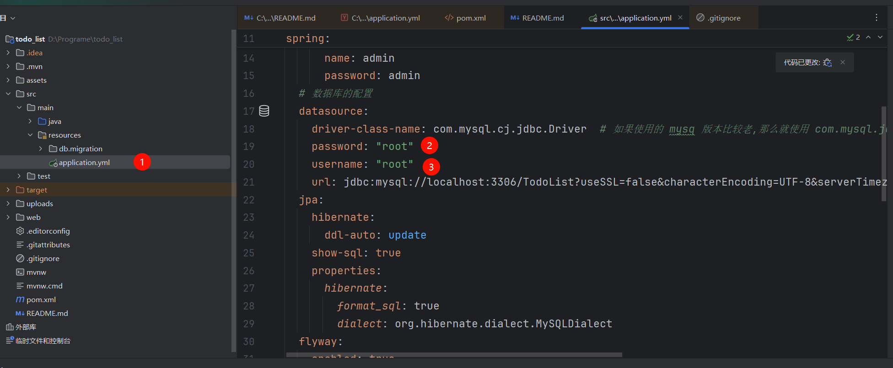
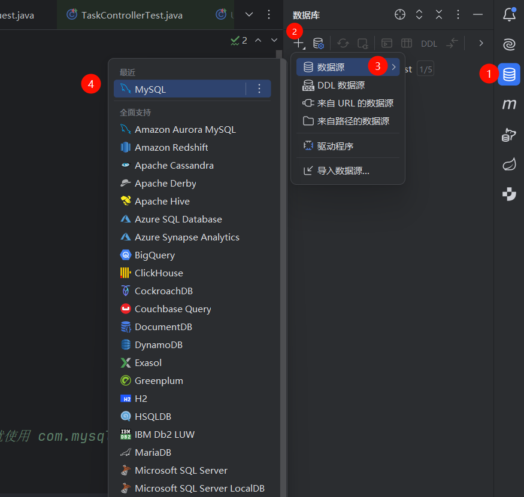
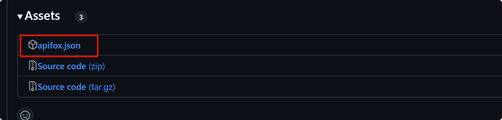
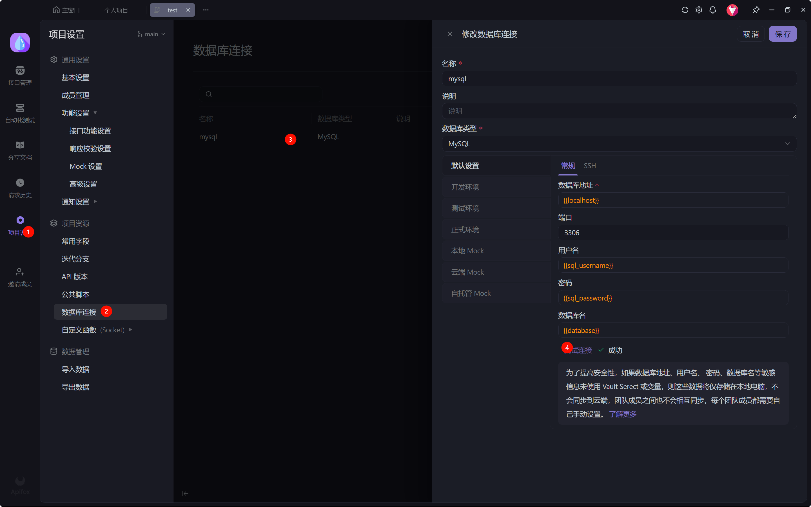

# 项目介绍

本项目将实现一个具备完整功能的 TodoList 系统，主要功能模块包括：

✅ **用户认证模块**

- 用户注册与登录
- 登出功能
- 用户信息更新
- 头像上传

✅ **任务管理模块**

- 任务的增删改查(CRUD)
- 任务分类管理
- 状态与截止时间管理

✅ **安全控制模块**

- JWT 鉴权机制
- 全局异常处理
- 接口权限控制（登录/未登录状态）

📦 **技术栈**

- 后端：Spring Boot + Maven + MySQL
- 可选前端：React, Vue
- 接口测试：Apifox

> [!NOTE]
> **作者已实现部分**
>
> - 基础项目框架搭建
> - 全局异常处理机制
> - DTO 数据传输对象设计
> - JWT 鉴权配置
> - 常用工具类封装
>
> **需要实现部分**
>
> - 数据持久层（Repository）可以使用 JPA 或者 MyBatis. 接口文件都在 `/src/repository` 中, MayBatis 的 `xml` 文件都在 `/resources/mapper`
> - 业务逻辑层（Service）
> - 接口控制层（Controller）

---

# 环境准备

## 1. Maven 换源配置

创建配置文件（路径：`C:\Users\<你的用户名>\.m2\settings.xml`）：

```xml
<settings>
    <mirrors>
        <mirror>
            <id>aliyunmaven</id>
            <name>阿里云公共仓库</name>
            <url>https://maven.aliyun.com/repository/public</url>
            <mirrorOf>central</mirrorOf>
        </mirror>
    </mirrors>
</settings>
```

执行依赖安装：

```bash
mvn clean install -T 1C
```

## 2. JDK 配置


要求：

- 必须使用 JDK 21
- 配置项目SDK为21版本

## 3. 数据库配置

1. 创建数据库：

```sql
CREATE
DATABASE TodoList;
USE
TodoList;
```

2. 修改配置文件（application.yml）：



```yaml
spring:
    datasource:
        url: jdbc:mysql://localhost:3306/TodoList
        username: root  # 修改为你的数据库账号
        password: root  # 修改为你的数据库密码
```

3. 测试数据库连接：
   

------

# 接口测试指南

## Apifox 使用说明

1. 下载测试套件：
   

2. 导入测试配置：
   

3. 修改前置 url. 修改为 `http://127.0.0.1:8080`

   

4. 执行自动化测试：
   

✅ 成功测试示例：


------

# 开发提示

1. 使用 IDEA 的 TODO 功能定位待实现代码：
   
2. 启用被注释的方法（Ctrl+/）：
   
3. 数据库连通性检查：
   
4. 配置文件修改示例(修改成你的mysql的用户名和密码) ：
   


通过 Swagger 测试注册接口：

```url
http://localhost:8080/swagger-ui/index.html
```


-----------

# 项目设计

## 项目结构

```
src/
├── main/
│   ├── java/
│   │   └── com/
│   │       └── todo_list/
│   │           ├── controller/    # REST API 接口层
│   │           ├── service/       # 业务逻辑层
│   │           ├── repository/    # 数据访问层(DAO)
│   │           ├── model/         # JPA 实体类
│   │           ├── dto/           # 数据传输对象
│   │           ├── config/        # 配置类
│   │           ├── exception/     # 异常处理
│   │           ├── security/      # 安全配置
│   │           ├── utils/         # 工具类
│   │           └── Application.java
│   ├── resources/
│   │   ├── application.yml       # YAML 配置文件
│   │   └── db.migration/         # Flyway 迁移脚本
└── test/                         # 测试代码
```

## 数据模型设计

### 👤 User 用户模型

| 字段       | 类型   | 说明               |
| ---------- | ------ | ------------------ |
| username   | String | 用户名（唯一标识） |
| password   | String | 加密后的密码       |
| avatar_url | String | 头像存储地址       |

### 📝 Task 任务模型（多对一关系）

| 字段             | 类型    | 说明       |
| ---------------- | ------- | ---------- |
| task_name        | String  | 任务名称   |
| task_description | String  | 任务描述   |
| deadline         | Long    | 截止时间戳 |
| status           | Boolean | 完成状态   |
| todo_list_id     | Long    | 所属清单ID |

### 📂 TodoList 任务清单（一对多关系）

| 字段     | 类型   | 说明       |
| -------- | ------ | ---------- |
| category | String | 清单分类   |
| user_id  | Long   | 所属用户ID |

------

## 接口规范

### 👤 用户相关接口

| 端点                | 方法  | 参数                        | 说明                   |
| ------------------- | ----- | --------------------------- | ---------------------- |
| `/user/register`    | POST  | username, password          | 用户注册               |
| `/user/login`       | POST  | username, password          | 用户登录（返回Cookie） |
| `/user/logout`      | GET   | -                           | 用户登出               |
| `/user/{id}`        | PATCH | username/password/avatarUrl | 更新用户信息           |
| `/user/upload/{id}` | POST  | 图片文件                    | 上传用户头像           |

### 📂 任务清单接口


```
## 🧩 前端通用工具与类型定义说明

本文件主要说明了项目中 `types/`、`utils/` 目录下的工具函数、类型定义与全局配置用途及使用方式

### 📁 `types/index.tsx`

#### `WebResponse<T>`

统一定义接口响应结构，适用于所有后端 API 通信的泛型封装。

```ts
export interface WebResponse<T> {
  code: number;        // 状态码，如 200 表示成功，1004 表示未登录等
  data?: T;            // 返回的泛型数据
  msg?: string;        // 错误或成功提示信息
  ts: number;          // 时间戳
  total?: number;      // 数据总量（用于分页）
}
```


### 📁 `utils/index.ts`

🧩 `cn(...)` 工具函数

```ts
import { clsx, type ClassValue } from "clsx";
import { twMerge } from "tailwind-merge";

export function cn(...inputs: ClassValue[]) {
  return twMerge(clsx(inputs));
}
```

##### ✅ 功能说明

- 用于合并多个类名字符串，自动解决 Tailwind CSS 的类冲突。
- 类似 `classnames`，但增强了 Tailwind 专用的合并逻辑。

### 📁 `utils/alova.ts`

#### 🌐 网络请求封装

使用 alova 配合 fetch 构建统一请求器。

```ts
import { createAlova } from "alova";
import adapterFetch from "alova/fetch";

export const alova = createAlova({
  baseURL: "/api",
  requestAdapter: adapterFetch(),
  timeout: 5000,
  shareRequest: true,
  statesHook: ReactHook,
  responded: {
    onSuccess: async (response, _method) => {
      const res = await response.json();
      // 通用拦截逻辑
    }
  }
});
```

##### 🔐 通用拦截逻辑

- `1004`: 未登录 → 跳转登录页并清除用户状态。
- `502`: 后端挂了 → 弹出错误提示。

### 📁 `utils/global-router.ts`

#### 🌍 全局路由跳转支持

```ts
const globalRouter = { navigate: undefined } as {
  navigate?: NavigateFunction;
};

export default globalRouter;
```

##### 🧭 使用方式 (具体的使用在项目代码里写了注释)

在 `layout.tsx` 中初始化：

```tsx
globalRouter.navigate = useNavigate();
```


## 📦 状态管理模块：`storages/`

### 1. `auth.ts` - 用户认证状态管理

**路径**：`storages/auth.ts`
 **依赖**：[Zustand](https://github.com/pmndrs/zustand)、`User` 模型

```ts
// storages/auth.ts

import { User } from "@/models/user";
import { create } from "zustand";
import { createJSONStorage, persist } from "zustand/middleware";

/**
 * ✅ 说明：
 * 全局用户认证状态管理
 * - 使用 zustand 管理用户登录信息
 * - 支持持久化存储（localStorage），实现刷新页面后仍保持登录
 *
 * ✅ 为什么使用 zustand？
 * - 简洁轻量
 * - 使用简单但功能强大(persist)
 */

// 用户状态接口
interface AuthState {
    user?: User;                      // 当前登录用户（包括用户名、头像等）
    setUser: (user?: User) => void;  // 设置用户信息（登录后使用）
    clear: () => void;               // 清空用户信息（登出时使用）
}

// 创建状态管理：useAuthStore 包含 user, setUser, clear
export const useAuthStore = create<AuthState>()(
    persist(
        (set, _get) => ({
            setUser: (user?: User) => set({ user }),     // 设置用户
            clear: () => set({ user: undefined }),       // 清空用户
        }),
        {
            name: "auth",                                 // localStorage 的 key 名称
            storage: createJSONStorage(() => localStorage), // 使用 localStorage 存储
        }
    )
);

```


#### ✅ 功能说明

`auth.ts` 使用 `zustand` 管理全局的用户认证状态。它负责：

- 存储当前登录用户的信息（如用户名、头像等）
- 在用户登录、退出时更新状态
- 利用 `zustand/middleware/persist` 插件将状态持久化到 `localStorage`，支持页面刷新后的状态保持

#### 📘 使用场景

- 判断用户是否已登录
- 获取当前用户信息用于展示（如头像、昵称）
- 实现退出登录时的状态清除
- 页面刷新后自动保持登录状态

通过 `useAuthStore()` 可访问：

- `user`: 当前用户对象（可为空）
- `setUser(user?: User)`: 设置用户信息
- `clear()`: 清除用户信息（登出时调用）

### 2. `shared.ts` - 通用刷新状态管理

**路径**：`storages/shared.ts`
 **依赖**：仅依赖 `zustand`

```ts
// storages/shared.ts

import { create } from "zustand";

/**
 * ✅ 说明：
 * 用于组件之间共享状态的全局 store
 * 当前仅用于提供页面/组件刷新信号
 *
 * 使用场景示例：
 * - 用户更新信息后，需要其他组件重新拉取数据
 * - 点击某个操作，想通知多个组件重新加载
 */

// 共享状态接口
interface SharedState {
    refresh: number;        // 每次更新都会自增，触发依赖该值的组件重新渲染
    setRefresh: () => void; // 执行一次刷新：refresh + 1
}

// 创建共享状态管理：useSharedStore 包含 refresh 和 setRefresh
export const useSharedStore = create<SharedState>()((set, get) => ({
    refresh: 0,
    setRefresh: () => set({ refresh: get().refresh + 1 }),
}));

```


#### ✅ 功能说明

`shared.ts` 提供一个简单的全局状态 `refresh`，用于跨组件传递“刷新信号”。

- 通过递增的 `refresh` 数值，实现依赖组件的响应式刷新
- 适合用在“某个地方数据变了，其他地方需要感知并刷新”这种场景中

#### 📘 使用场景 (在update-list-dialog中的例子)

```tsx
const sharedStore = useSharedStore()
const onSubmit = form.handleSubmit(async (values) => {
        setLoading(true)
        try {
            ...
            if (res.code === 200) {
                sharedStore.setRefresh()// 在操作成功后手动触发一次全局刷新信号，侧边栏会出现新的list名字
                onClose()
                navigate(`/list/${values.category}`)//然后跳转到更新的list页面
            } ...
        } catch (err) {
           ...
        } finally {
            ...
        }
    })
return (
    ...
    <Form{...form}>
    	...
        <form onSubmit={onSubmit}...>
        	<Button
            ...
            type={"submit"}>
        	...
        	</Button>
        </form>
    </Form>
```


通过 `useSharedStore()` 可访问：

- `refresh`: 数值，每次调用 `setRefresh()` 都会 +1
- `setRefresh()`: 用于手动触发刷新


## 📁 `models/user.ts` 模块说明文档

### ✅ 作用

定义项目中与「用户（User）」相关的数据结构，即 `User` 类型接口。它用于标识、约束用户对象包含的字段类型，是整个项目在登录、注册、更新用户信息等操作中统一使用的用户模型。

### 📦 User 接口字段说明

```ts
export interface User {
    id?: number; // 用户 ID
    username?: string; // 用户名
    password?: string; // 密码（登录或注册时用）
    confirm_password?: string; // 确认密码（注册时使用）
    avatarUrl?: string; // 用户头像 URL
}
```

> 所有字段均为 ?（`表示可选`），以方便在表单处理、局部更新时使用。

### 🧠 使用场景

- 注册表单中，使用 `User` 模型进行类型推导；
- 登录响应中，服务端返回的用户数据统一使用该结构；
- 在全局状态 `auth.ts` 中存储的 `user` 类型也是该接口。

## 📁 `api/user/index.ts` 模块说明文档

### ✅ 作用

封装与「用户」相关的所有 API 请求方法，所有请求都通过 `alova` 请求实例发出，并统一使用 `WebResponse` 类型封装响应结果。

### 📡 API 一览表

| 方法名         | 请求路径         | 请求方式 | 用途         |
| -------------- | ---------------- | -------- | ------------ |
| `login`        | `/user/login`    | POST     | 登录         |
| `logout`       | `/user/logout`   | GET      | 注销登录     |
| `register`     | `/user/register` | POST     | 注册账号     |
| `updateUser`   | `/user`          | PATCH    | 修改用户信息 |
| `uploadAvatar` | `/user/upload`   | POST     | 上传用户头像 |


### 🧩 请求类型定义

```ts
// 登录请求体
export interface UserLoginRequest {
    username: string;
    password: string;
}

// 注册请求体
export interface UserRegisterRequest {
    username: string;
    password: string;
    confirm_password: string;
}

// 更新用户信息请求体
export interface UserUpdateRequest {
    id: number;
    username?: string;
    password?: string;
}
```


### 🔄 响应格式统一封装

所有 API 响应都使用如下通用格式封装：

```ts
interface WebResponse<T> {
    code: number;
    data?: T;
    msg?: string;
    ts: number;
    total?: number;
}
```

例如：

- 登录返回：`WebResponse<User>`
- 上传头像返回：`WebResponse<string>`（返回头像地址）
=======
| 端点                         | 方法   | 参数     | 说明             |
| ---------------------------- | ------ | -------- | ---------------- |
| `/list/{category}`           | PUT    | category | 创建新任务清单   |
| `/list/{id}`                 | DELETE | -        | 删除指定清单     |
| `/list/change_category/{id}` | PATCH  | category | 修改清单分类     |
| `/list/`                     | GET    | -        | 获取所有清单     |
| `/list/{id}`                 | GET    | -        | 获取指定清单详情 |

### 📝 任务管理接口

| 端点         | 方法   | 参数                         | 说明         |
| ------------ | ------ | ---------------------------- | ------------ |
| `/task/`     | POST   | category, name, status=false | 创建新任务   |
| `/task/{id}` | GET    | -                            | 获取任务详情 |
| `/task/{id}` | DELETE | -                            | 删除任务     |
| `/task/{id}` | PATCH  | 任意任务字段                 | 更新任务信息 |

------

## 异常处理规范

### 👤 用户相关异常

| 异常描述         | 错误码 | 触发场景                   |
| ---------------- | ------ | -------------------------- |
| 非法用户名       | 1001   | 用户名不符合格式规范       |
| 用户名或密码错误 | 1002   | 登录验证失败               |
| 用户名已存在     | 1003   | 重复注册                   |
| 未登录访问       | 1004   | 无有效Cookie访问受保护接口 |
| 用户不存在       | 1005   | 更新不存在的用户信息       |

### 📝 任务相关异常

| 异常描述     | 错误码 | 触发场景               |
| ------------ | ------ | ---------------------- |
| 非法时间参数 | 2001   | 超过2038年的时间戳     |
| 任务不存在   | 2002   | 操作不存在任务         |
| 过去时间设置 | 2003   | 设置过去时间为截止时间 |
| 非法状态参数 | 2004   | 新建任务时status=true  |

### 📂 清单相关异常

| 异常描述     | 错误码 | 触发场景           |
| ------------ | ------ | ------------------ |
| 重复清单分类 | 3001   | 创建重复分类的清单 |
| 清单不存在   | 3002   | 操作不存在清单     |

> [!WARNING] 注意
> 未处理的异常将返回500错误：
>
> ```json
> {
> "code": 500,
> "message": "系统繁忙，请稍后重试"
> }
> ```
>>>>>>> master
