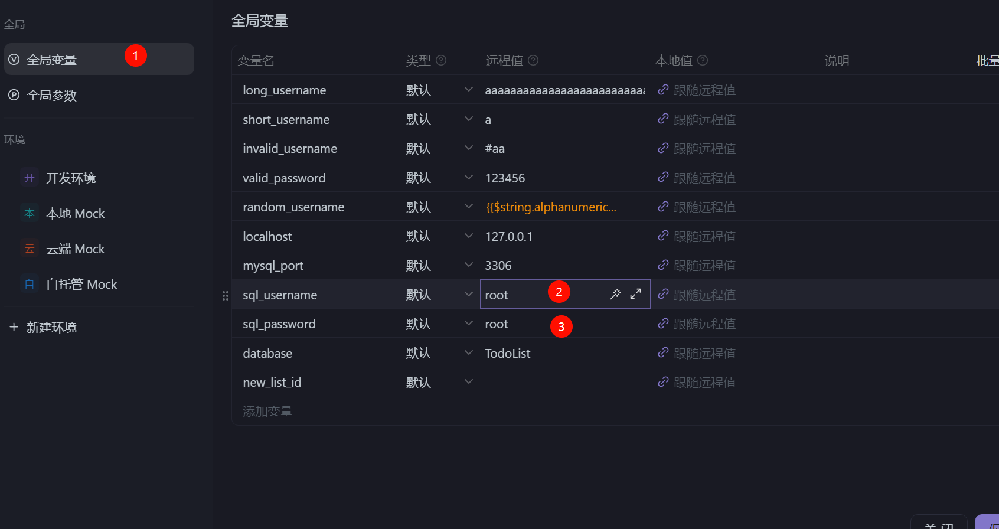

# 项目介绍

本项目将实现一个具备完整功能的 TodoList 系统，主要功能模块包括：

✅ **用户认证模块**

- 用户注册与登录
- 登出功能
- 用户信息更新
- 头像上传

✅ **任务管理模块**

- 任务的增删改查(CRUD)
- 任务分类管理
- 状态与截止时间管理

✅ **安全控制模块**

- JWT 鉴权机制
- 全局异常处理
- 接口权限控制（登录/未登录状态）

📦 **技术栈**

- 后端：Spring Boot + Maven + MySQL
- 可选前端：React, Vue
- 接口测试：Apifox

> [!NOTE]
> **作者已实现部分**
> - 基础项目框架搭建
> - 全局异常处理机制
> - DTO 数据传输对象设计
> - JWT 鉴权配置
> - 常用工具类封装
>
> **需要实现部分**
> - 数据持久层（Repository）
> - 业务逻辑层（Service）
> - 接口控制层（Controller）

---

# 环境准备

## 1. Maven 换源配置

创建配置文件（路径：`C:\Users\<你的用户名>\.m2\settings.xml`）：

```xml

<settings>
    <mirrors>
        <mirror>
            <id>aliyunmaven</id>
            <name>阿里云公共仓库</name>
            <url>https://maven.aliyun.com/repository/public</url>
            <mirrorOf>central</mirrorOf>
        </mirror>
    </mirrors>
</settings>
```

执行依赖安装：

```bash
mvn clean install -T 1C
```

## 2. JDK 配置


要求：

- 必须使用 JDK 21
- 配置项目SDK为21版本

## 3. 数据库配置

1. 创建数据库：

```sql
CREATE
DATABASE TodoList;
USE
TodoList;
```

2. 修改配置文件（application.yml）：


```yaml
spring:
    datasource:
        url: jdbc:mysql://localhost:3306/TodoList
        username: root  # 修改为你的数据库账号
        password: root  # 修改为你的数据库密码
```

3. 测试数据库连接：
   

------

# 接口测试指南

## Apifox 使用说明

1. 下载测试套件：
   
2. 导入测试配置：
   
3. 执行自动化测试：
   

✅ 成功测试示例：


------

# 开发提示

1. 使用 IDEA 的 TODO 功能定位待实现代码：
   
2. 启用被注释的方法（Ctrl+/）：
   
3. 数据库连通性检查：
   
4. 配置文件修改示例(修改成你的mysql的用户名和密码) ：
   


通过 Swagger 测试注册接口：

```url
http://localhost:8080/swagger-ui/index.html
```


-----------

# 项目设计

## 项目结构

```
src/
├── main/
│   ├── java/
│   │   └── com/
│   │       └── todo_list/
│   │           ├── controller/    # REST API 接口层
│   │           ├── service/       # 业务逻辑层
│   │           ├── repository/    # 数据访问层(DAO)
│   │           ├── model/         # JPA 实体类
│   │           ├── dto/           # 数据传输对象
│   │           ├── config/        # 配置类
│   │           ├── exception/     # 异常处理
│   │           ├── security/      # 安全配置
│   │           ├── utils/         # 工具类
│   │           └── Application.java
│   ├── resources/
│   │   ├── application.yml       # YAML 配置文件
│   │   └── db.migration/         # Flyway 迁移脚本
└── test/                         # 测试代码
```

## 数据模型设计

### 👤 User 用户模型

| 字段         | 类型     | 说明        |
|------------|--------|-----------|
| username   | String | 用户名（唯一标识） |
| password   | String | 加密后的密码    |
| avatar_url | String | 头像存储地址    |

### 📝 Task 任务模型（多对一关系）

| 字段               | 类型      | 说明     |
|------------------|---------|--------|
| task_name        | String  | 任务名称   |
| task_description | String  | 任务描述   |
| deadline         | Long    | 截止时间戳  |
| status           | Boolean | 完成状态   |
| todo_list_id     | Long    | 所属清单ID |

### 📂 TodoList 任务清单（一对多关系）

| 字段       | 类型     | 说明     |
|----------|--------|--------|
| category | String | 清单分类   |
| user_id  | Long   | 所属用户ID |

------

## 接口规范

### 👤 用户相关接口

| 端点                  | 方法    | 参数                          | 说明             |
|---------------------|-------|-----------------------------|----------------|
| `/user/register`    | POST  | username, password          | 用户注册           |
| `/user/login`       | POST  | username, password          | 用户登录（返回Cookie） |
| `/user/logout`      | GET   | -                           | 用户登出           |
| `/user/{id}`        | PATCH | username/password/avatarUrl | 更新用户信息         |
| `/user/upload/{id}` | POST  | 图片文件                        | 上传用户头像         |

### 📂 任务清单接口

| 端点                           | 方法     | 参数       | 说明       |
|------------------------------|--------|----------|----------|
| `/list/{category}`           | PUT    | category | 创建新任务清单  |
| `/list/{id}`                 | DELETE | -        | 删除指定清单   |
| `/list/change_category/{id}` | PATCH  | category | 修改清单分类   |
| `/list/`                     | GET    | -        | 获取所有清单   |
| `/list/{id}`                 | GET    | -        | 获取指定清单详情 |

### 📝 任务管理接口

| 端点           | 方法     | 参数                           | 说明     |
|--------------|--------|------------------------------|--------|
| `/task/`     | POST   | category, name, status=false | 创建新任务  |
| `/task/{id}` | GET    | -                            | 获取任务详情 |
| `/task/{id}` | DELETE | -                            | 删除任务   |
| `/task/{id}` | PATCH  | 任意任务字段                       | 更新任务信息 |

------

## 异常处理规范

### 👤 用户相关异常

| 异常描述     | 错误码  | 触发场景             |
|----------|------|------------------|
| 非法用户名    | 1001 | 用户名不符合格式规范       |
| 用户名或密码错误 | 1002 | 登录验证失败           |
| 用户名已存在   | 1003 | 重复注册             |
| 未登录访问    | 1004 | 无有效Cookie访问受保护接口 |
| 用户不存在    | 1005 | 更新不存在的用户信息       |

### 📝 任务相关异常

| 异常描述   | 错误码  | 触发场景             |
|--------|------|------------------|
| 非法时间参数 | 2001 | 超过2038年的时间戳      |
| 任务不存在  | 2002 | 操作不存在任务          |
| 过去时间设置 | 2003 | 设置过去时间为截止时间      |
| 非法状态参数 | 2004 | 新建任务时status=true |

### 📂 清单相关异常

| 异常描述   | 错误码  | 触发场景      |
|--------|------|-----------|
| 重复清单分类 | 3001 | 创建重复分类的清单 |
| 清单不存在  | 3002 | 操作不存在清单   |

> [!WARNING] 注意
> 未处理的异常将返回500错误：
>
> ```json
>{
>"code": 500,
>"message": "系统繁忙，请稍后重试"
> }
> ```
